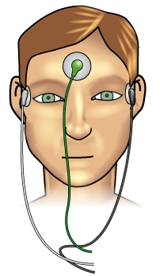

# Electrooculogram based Assistive Communication System
January 2019 - April 2019

* Developed an EOG based typing system that uses a virtual keyboard to assist individuals with motor neuron diseases to  communicate.
* Eye saccades were tracked by acquiring signals from muscles surrounding the eye, conditioned using cleverly designed analog circuits

* /Code contain several code that were used during testing. Some of them are as:
1) 1 to 6_tkinter.py  : different version of GUI which take input from 1.txt.
2) keyboard_config.py : configration of keybinding in keyboard.
3) pyserial.py        : scripts to read analog data of eog electrode from arduino
4) save.txt           : user data saved here if he want to save after typing
5) 1.txt              : processed data genrated by pyserial.py

